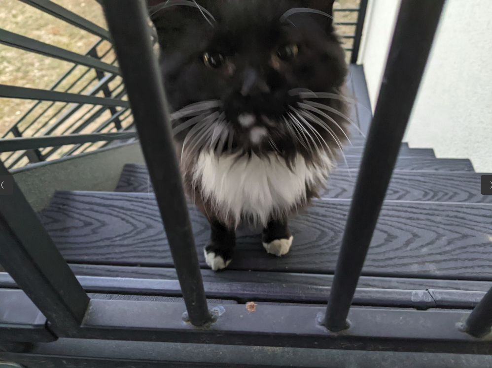

I consider it a mark of a life well lived if, at any point, we can look back at our former selves and say we aren't the same person we were a decade ago. I'm a lifelong seeker and have learned from experience not to take my own opinions too seriously. My interests and ideas are in frequent flux, and I will continue to evolve until I'm dead without suffering some sort of identity crisis. But if a future me ever denies that I love cats, we can be fairly certain I've been abducted and replaced with a fake.

About two years ago I decided to put this facet of my personality to good use and volunteer at an animal rescue. The Humane Society of Northern Utah is a foster and adoption network in Utah's Box Elder and Weber counties, funded and operated entirely by volunteers. They have a cat sanctuary, home to around 70 adult cats. The sanctuary is run by a few core volunteers and board members, including a retired couple who spend tens of thousands out of pocket each year on the cats, primarily on vet bills (cat dentals are expensive!).

My part is small. Every Saturday I spend a few hours at the sanctuary cleaning the kitties' spaces, giving them love, and telling them I would take them home with me if I could. I have acquired two sanctuary cats already, and with three cats at home now, I'm told by the other human in the house that I've met my quota.  

As a lifelong cat lover and two-year cat rescuer, allow me to make some observations:

1. **There's no such thing as a cat personality.** While cats all share a common cat nature, they are as diverse in personality as dogs and humans. I've met shy, reserved cats and outgoing centers of attention, tiny hell-raisers and gentle giants, affectionate lap cats and some total jerks. And just as with humans, their personalities evolve over time and adapt to changing circumstances.
2. **You can't judge a cat by how it behaves at a shelter.** While most of the cats adapt pretty well to life at the sanctuary, there are occasional exceptions: my two acquisitions, for instance, named Fluffy and Chip. I adopted them because they both took poorly to sanctuary life and it broke my heart each week to see them so depressed and lethargic. They are both so happy and energetic now, each with their own quirky personality and personal space (so important).
3. **Not all cats need rescuing.** Some cats do well as *community cats*, and the best you can do for them is let them continue living that life. Even if the cat is friendly and comes to your door every night, that doesn't necessarily mean he wants to be YOUR cat. Unless he looks emaciated and unhealthy, consider that he might just be stopping by to say Hi. Take a lesson from me: Last year I tried rescuing Frankie, a.k.a. "Frank the Tank," a big sweet boy who would show up at my back deck every night to meow his tail off. He looked healthy but was so persistent that I figured he must be starving for my love (cuz he clearly wasn't starving for food). After confirming with neighbors that he didn't belong to them, I trapped him, had him neutered and ear-tipped, and released him back into my yard. But he kept coming around. Soon winter came and I began to worry that he would freeze. One especially cold night I stuck him in our basement. And he had OPINIONS. He went from sweet and friendly to aggressive and MEAN! And I can't blame him. I had effectively abducted and imprisoned him. The next morning I set him loose and created an insulated shelter so he would have a warm place to sleep (which he never used). Long story short, he turned out to be a bully. He figured out how to jump onto our deck and attack my indoor-only cats---possibly the reason he was begging at the door in the first place. After I inadvertently trapped him a second time and he got to spend the night in my garage, he stopped coming around. I saw him once again six months later, and he was doing just fine---a little worse for wear, but he was making it work, living his best life. My advice: If kitty wishes to be free, let him be.

4. ***Felis catus* is not a wild animal.** Domestic cats would not exist if not for humans. The species morphed over thousands of years through a symbiotic relationship with humans, and the species evolved via artificial selection. It's a mistake to assume a cat will have the same survival skills as a wild animal. It depends largely on the individual, but some cats simply cannot survive without humans, and all domestic cats depend on humans to some extent. As I see it, we created them, and so we have a responsibility to care for them and to keep their population under control.

5. **Trapping, neutering, and releasing (TNR) feral cats is a community responsibility.** If you're caring for a feral colony---or know some stray cats in your neighborhood---please get those guys fixed. Many cities have programs where people can trap ferals and get them spayed/neutered and ear-tipped for free. You then release them in the same place where you trapped them so they can continue doing whatever it is they've been doing to survive. The goal is to keep the population down so there are enough resources for the cats to survive and be happy.  

