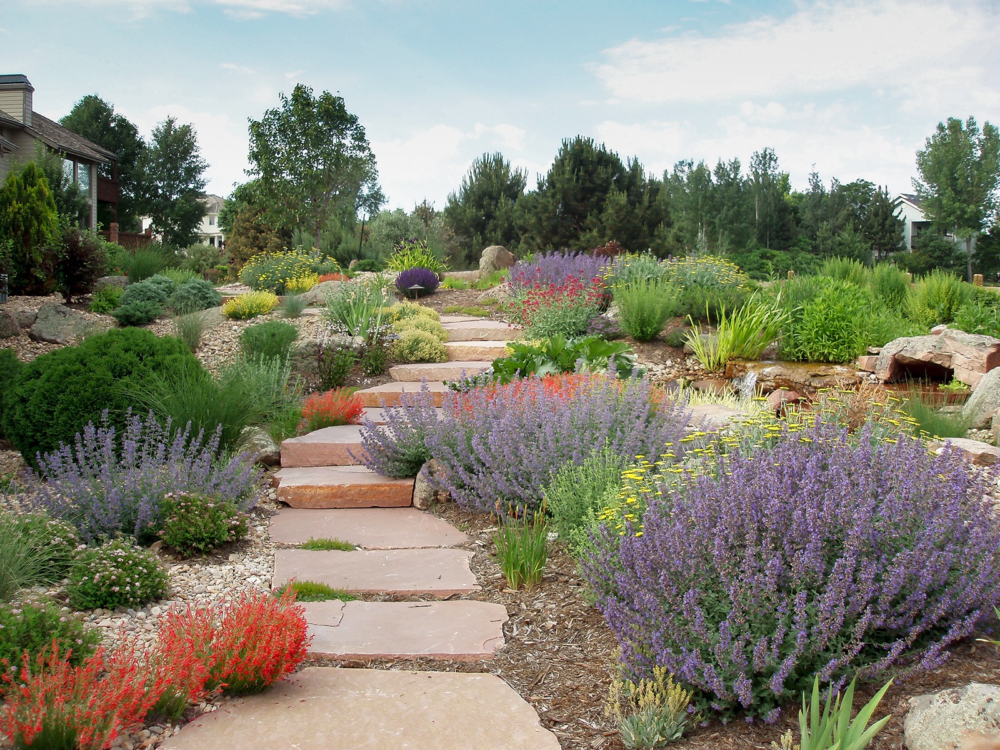

When we moved into our Utah house two summers ago, I embarked on a landscaping project that has brought me varying degrees of pleasure, pain, and dismay.

The pleasure: I enjoy yard work if the end result is that I've created something pretty. I will gladly spend hours pulling weeds---provided they are MY weeds. I would rather spend money on plants than anything else.

The pain: The soil on our property is terrible. Seriously, I didn't know they made dirt that bad. The rocks aren't the problem, it's the clay. I am forced to dig holes with a pickax.

The dismay: My vision of a lawn-less backyard profuse in sustainable, climate-appropriate vegetation---my beautiful, inspired desert *Dharma*scape---looks like this:
   

Maybe it's not too bad. But the gravel path!

> I can just imagine little kids riding their Big Wheels around your backyard!  
> — Mom

That Big Wheels track is supposed to be a meditation path. All those little dashes of almost color were supposed to do this:

We did hire a landscape designer, and I was pretty firm in telling her exactly what I did and did not want. The problem is she listened. But I require supervision if I'm going to venture outside my lane and do something creative. I need someone with more artistic sense to walk me back from my bad idea.

Clearly the path needs narrowing and the gravel needs to go. The hideous gravel. I have the idea of completely eliminating the inner path, reworking the central circle, and adding stepping stones to cut across some of the growth. The "growth." If the plants ever do start growing, I might have the courage to proceed.

For now I will continue replacing the shrubs because the landscapers didn't dig adequate holes and basically planted them in solid clay. I've already replaced a few dozen dead from root rot (in the desert!).

I'm sure there's a lesson in this. I need to let go of control---because the deer ARE going to eat my roses. I need to practice patience, because fixing this is going to take years. In the meantime, I suppose, I need to take Patrul Rinpoche's heart advice and just settle into whatever is going to occur in my backyard. Maybe I did get my *Dharma*scape.
